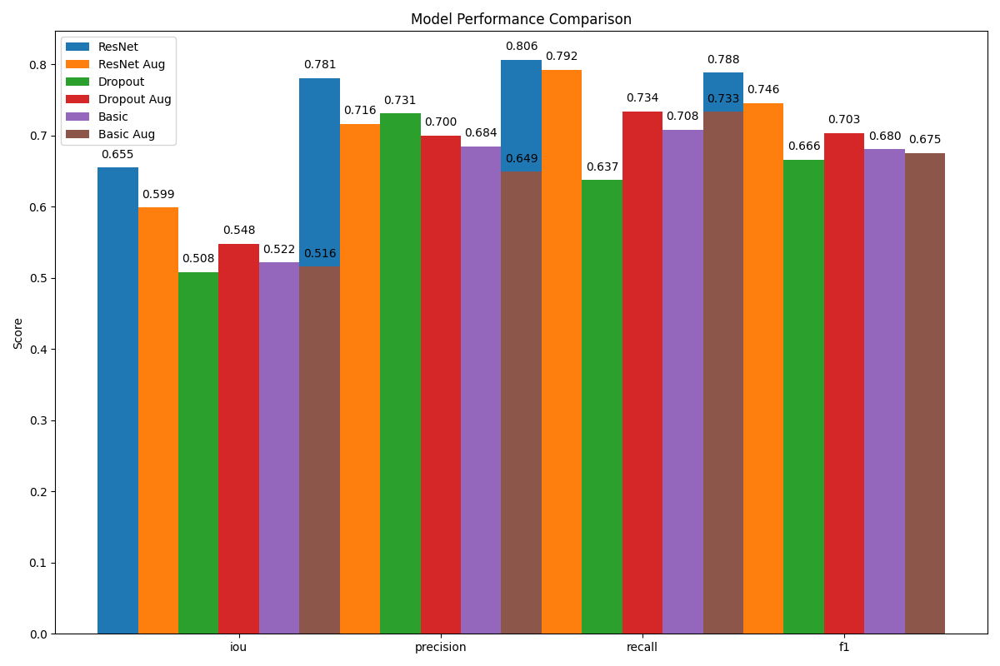
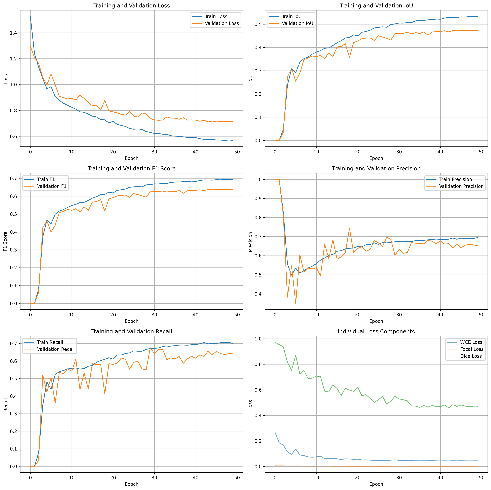
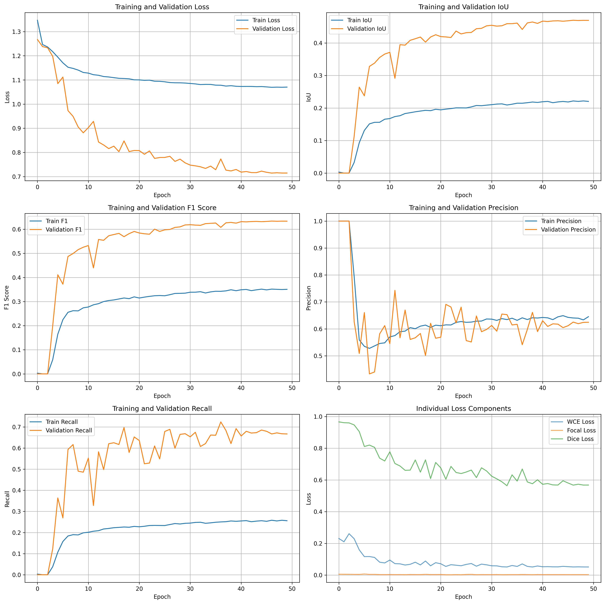
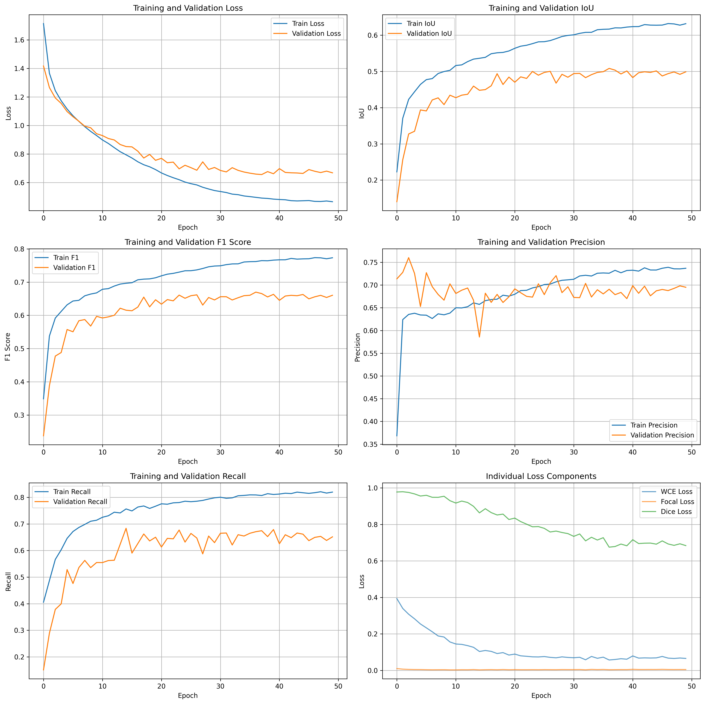
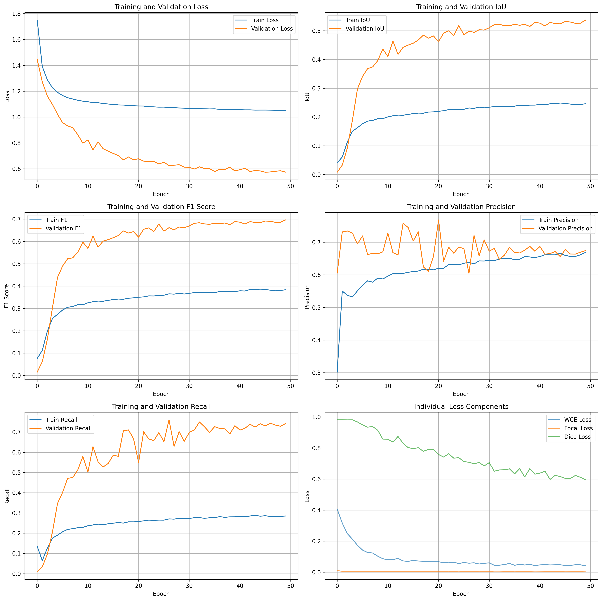
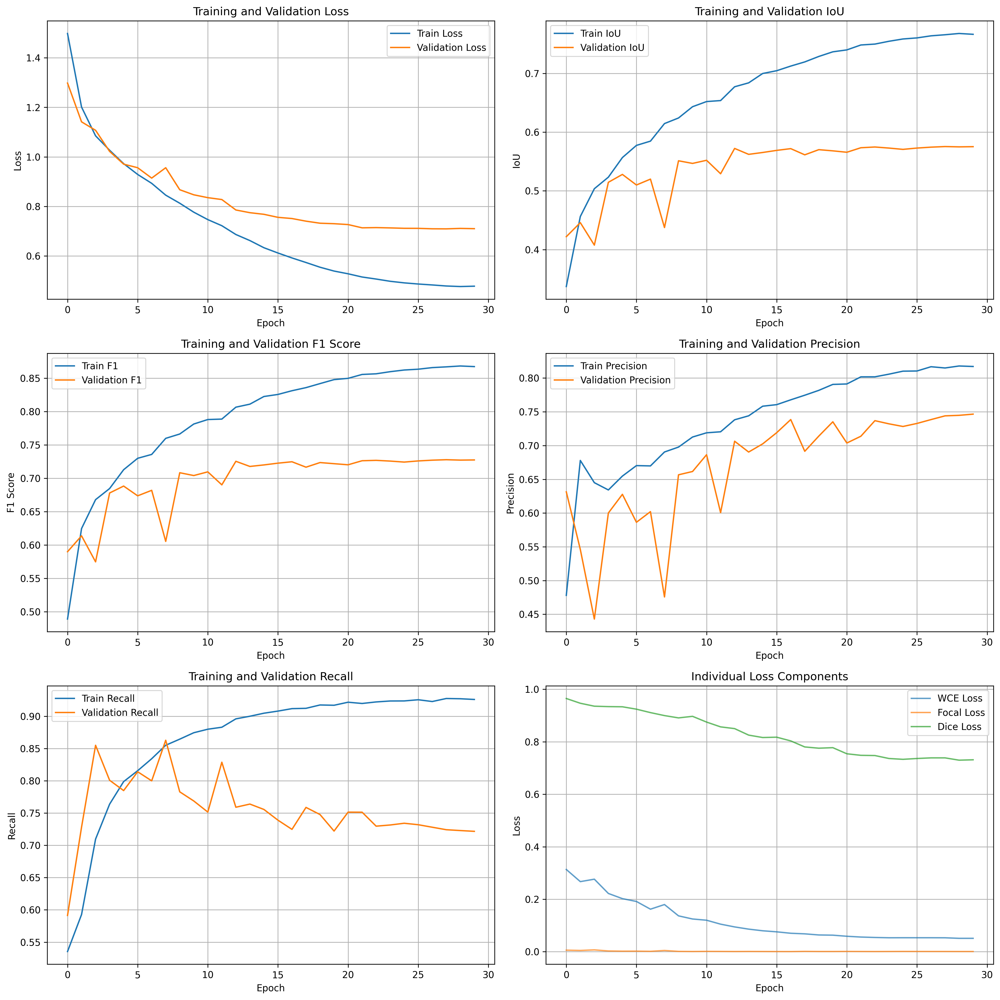
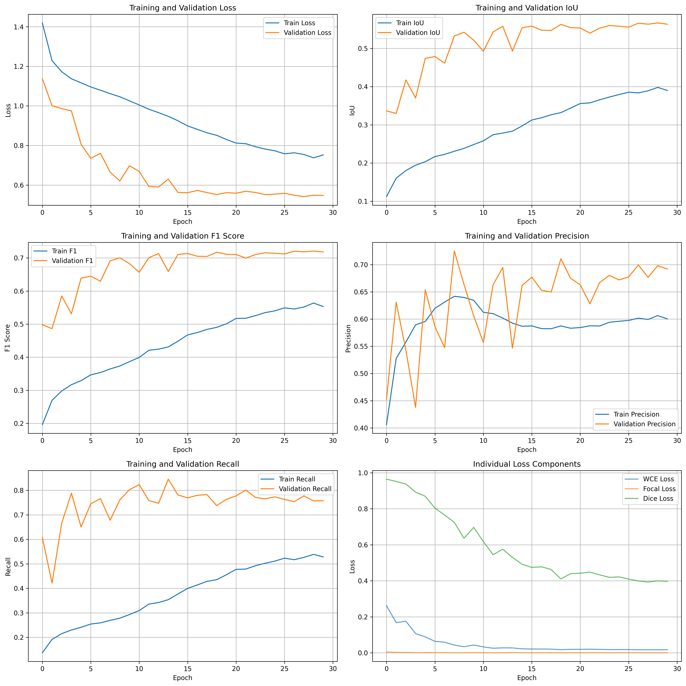
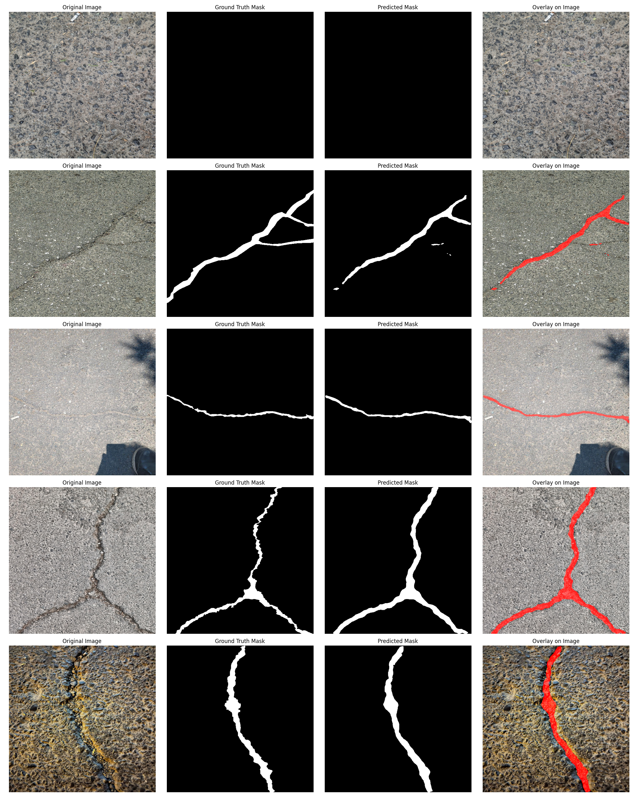
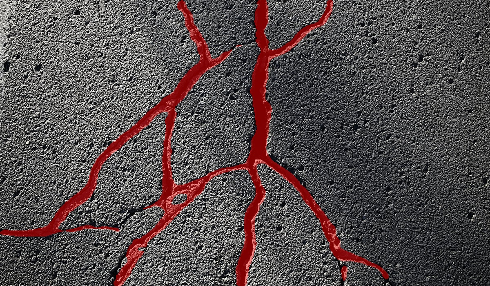

# Crack Segmentation (Semantic Segmentation of Concrete Cracks)

End-to-end project for semantic segmentation of cracks in images. It covers:
- Data labeling (Roboflow), consolidation of student datasets, preprocessing to NumPy, and offline augmentation
- Data loading with PyTorch `Dataset`/`DataLoader`
- Three model families: basic U-Net-like, regularized (BatchNorm+Dropout), and transfer learning (ResNet34 encoder)
- Training with a combined loss (Weighted BCE + Focal + Dice), validation, TensorBoard logging
- Evaluation, model comparison, and single-image inference

The accompanying report is in `Crack Segmentation.pdf`.

> Note: This repository is the final project for the Computer Vision course (Bachelor's degree) at KNTU, taught by Dr. Nasihatkon.


## Dataset

- Labels: annotated in Roboflow
  - Roboflow project: https://universe.roboflow.com/personal-kpdng/crack_detection-1mexu
- Working dataset: concatenation of multiple students' labeled data (merged). We train/evaluate on preprocessed NumPy arrays (images and masks) already organized in this repo under `data/`.
- Folder layout used by the code (already present):

```
data/
  train/
    images_np/           # float32 HxWx3 in [0,1] 512 512 3
    masks_np/            # int {0,1} HxW
    augmented_images_np/ # optional offline aug splits used for *_aug runs
    augmented_masks_np/
  val/
    images_np/
    masks_np/
    augmented_images_np/
    augmented_masks_np/
  test/
    images_np/
    masks_np/
```

- Preprocessing (if starting from raw JPG/PNG): convert RGB images to float32 [0,1] NPY and binary masks to int {0,1} NPY, matching names. The training `Dataset` expects `.npy` files and will raise if they are missing.

Minimal example (pseudo-code):
```python
# Save image.npy (HxWx3 float32 in [0,1]) and mask.npy (HxW int {0,1}) with the same filename
# to data/{split}/images_np and data/{split}/masks_np respectively.
```

Augmentation: For augmented experiments (files with `*_aug.pth`), augmentations were applied offline to produce `augmented_*_np/` and used during training.


## Models

Implemented in `codes/`:
- Basic U-Net-like (`codes/basicmodel/model.py`): encoder-decoder with skip connections.
- Regularized U-Net-like (`codes/dropoutnormal/model.py`): adds BatchNorm + Dropout at multiple depths.
- Transfer learning (`codes/resnet/model_transfer.py`): ResNet-34 encoder (ImageNet weights) + custom decoder, with early encoder layers frozen.

Common training details:
- Loss: Combined Weighted BCE + Focal + Dice
- Optimizer: Adam (lr 1e-4), CosineAnnealingLR
- Metrics: IoU, Precision, Recall, F1 (threshold 0.5)
- Input size: 512x512 (preprocessed arrays)


## Results

Aggregated test performance (see `model_comparision.txt` and `model_comparison.png`):

| Model       | IoU      | Precision | Recall   | F1       |
|-------------|----------|-----------|----------|----------|
| ResNet      | 0.654834 | 0.780647  | 0.806234 | 0.788314 |
| ResNet Aug  | 0.598692 | 0.716401  | 0.792152 | 0.745710 |
| Dropout     | 0.507822 | 0.730633  | 0.637040 | 0.666216 |
| Dropout Aug | 0.547647 | 0.699984  | 0.734084 | 0.703276 |
| Basic       | 0.521685 | 0.684426  | 0.707914 | 0.680308 |
| Basic Aug   | 0.515830 | 0.649092  | 0.732971 | 0.675232 |

- Comparison plot:



- Training history plots per model:

  - Basic: 
  - Basic (aug): 
  - Dropout: 
  - Dropout (aug): 
  - ResNet: 
  - ResNet (aug): 

- Inference samples:




## Repository layout

- `codes/Dataset.py` – PyTorch dataset and dataloader for preprocessed NPYs
- `codes/PreprocessDataset.ipynb` – Download, split dataset and preprocessing them to NPY files . If we nedd we can augment data too 
- `codes/basicmodel/` – baseline U-Net-like model and trainer
- `codes/dropout/` – regularized model (BatchNorm+Dropout) and trainer
- `codes/resnet/` – ResNet34 encoder transfer learning model and trainer
- `codes/test_image.py` – single image inference with overlay output
- `codes/test_compare_models.py` – loads saved checkpoints and produces `model_comparison.png`
- `codes/test_on_dataset.py` – saves some sample of test data inference `_infer_samples.png`
- `codes/evaluate.py` – evaluate a given checkpoint on the test set
- `final_model_*.pth` – best trained checkpoints (provided)
- `runs/` – TensorBoard logs (runs)
- `Crack Segmentation.pdf` – project document


## Installation

- Python: 3.10–3.13 recommended
- Create a virtual environment and install packages:

```bash
python -m venv .venv
source .venv/bin/activate
pip install -r requirements.txt
```

If PyTorch with CUDA is desired, install a matching build from https://pytorch.org/get-started/locally/.


## Train

The code expects:
- run train.py
- sure data dir is in root dir with train code . 
```bash
data/
  train/
    images_np/           
    masks_np/         
  val/
    ...
  test/
    ...
train.py
```


Notes:
- Edit hyperparameters at the top of each `train.py` (`BATCH_SIZE`, `NUM_EPOCHS`, `LEARNING_RATE`).
- Checkpoints are saved every 5 epochs and the best by F1.
- TensorBoard (old runs and new):
```bash
tensorboard --logdir runs,runs-Aug
```


## Evaluate and compare

- Evaluate a single model on test set (example uses ResNet):
```bash
python codes/evaluate.py
```
- Reproduce the comparison table/plot for all provided weights:
```bash
python codes/test_compare_models.py
```
This prints metrics and saves `model_comparison.png`.


## Inference on a single image

- Put an input image in the repo root (e.g., `image.jpg`) or provide a path.
- Edit `codes/test_image.py` to set `model_path` and `model_type` (`basic`, `dropout`, `resnet`).
- Run:
```bash
python codes/test_image.py
```
It writes an overlay result next to the input (e.g., `result.jpg`).

Example:
- Input image:


- Output overlay:



To visualize a few random test samples and save a grid to `_infer_samples.png`:
```bash
python codes/test_on_dataset.py
```


## Data preparation (from raw images/masks)

If you start from raw images and masks (e.g., exported from Roboflow), produce `.npy` arrays that match the expected format:
- Images: HxWx3 float32, values in [0,1]
- Masks: HxW, integers in {0,1}

Create matching filenames under `data/{train|val|test}/images_np/` and `data/{...}/masks_np/`. The code raises a helpful error if NPYs are missing.
you can use jupiter notebook (PreprocessDataset.ipynb)


## Requirements

See `requirements.txt`. Core packages:
- torch, torchvision
- numpy
- opencv-python
- matplotlib
- tensorboard
- pillow

GPU is optional but recommended for training.


## Acknowledgments

- Labels curated with Roboflow; dataset here is a merged set from multiple student contributors.
- Pretrained encoder based on torchvision ResNet-34.
